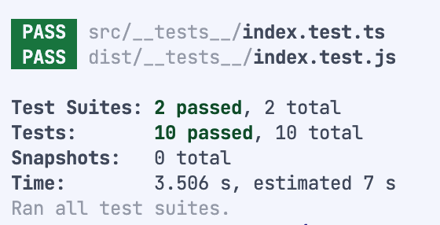

# Node.js + Express API with Google IDX

This project is a simple Node.js API built using Express.js and Google Cloud's IDX (Identity Exchange). It provides sample endpoints to fetch mock data for employees, employers, and personal information.

## Project Details

* **Purpose:** To demonstrate building a basic API using Node.js, Express.js, and Google IDX.
* **Technologies:**
    * Node.js
    * Express.js
    * Google Cloud IDX
* **Dependencies:**
    * express
    * supertest (for testing)
    * jest (for testing)
    * @types/jest
    * ts-jest (for testing)


## Setup Instructions

1. **Clone the repository:**
   

Server should run automatically when starting a workspace. To run manually, run:
```sh
npm run dev
```

### Test output
```

```